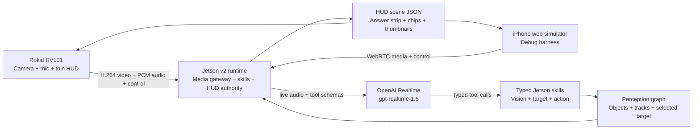
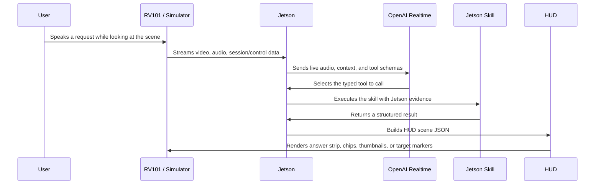
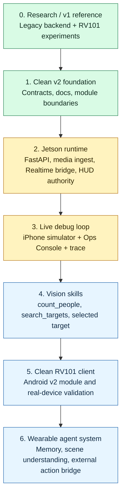

# OpenVision Rokid

**OpenVision Rokid** is a vision-first wearable AI assistant platform for Rokid RV101 glasses and NVIDIA Jetson. The glasses act as a thin camera, microphone, transport, and HUD terminal, while Jetson and OpenAI Realtime work together to understand live voice, inspect the scene, call typed real-world skills, and render compact HUD results back to the user.

The project is designed for the moment when a person is looking at the world and needs help without pulling out another screen: count people, find a person by appearance, follow a selected target, ask what is happening, or eventually trigger external actions through an explicit tool bridge.

## Goals

- Build a voice-first, vision-first assistant for Rokid RV101 smart glasses.
- Keep the glasses lightweight: capture, hardware encode, microphone, transport, session state, and HUD rendering.
- Use Jetson as the trusted local runtime for media ingest, skills, perception state, selected targets, and HUD authority.
- Use OpenAI Realtime as the live conversation and typed tool-selection brain.
- Grow into an OpenClaw-style wearable agent system for the physical world: perception, tracking, target search, memory, scene understanding, and action loops.

## System Architecture



### Live Runtime Flow



## Current Stage

OpenVision Rokid is currently in the **v2 product foundation** stage. The project has moved from prototype-heavy experiments into a cleaner architecture with explicit contracts, a Jetson service foundation, typed skills, HUD scene schemas, and an iPhone simulator for fast debugging.

Implemented today:

- Jetson FastAPI service foundation.
- Session store, event trace, and v2 control plane.
- OpenAI Realtime manager and tool-call event model.
- Typed skill registry/executor for `count_people`, `query_scene`, `search_targets`, `select_target`, `analyze_selected_target`, and `clear_target`.
- HUD authority and shared `HudScene` schema for glasses and simulator output.
- RV101 TCP ingest path for H.264 video and PCM audio.
- iPhone WebRTC simulator bridge for fast browser-based testing.
- Ops Console with health, sessions, Realtime trace, skill dry-run, HUD mirror, sensor preview, and Debug STT surfaces.
- Debug STT sidecar through a local PhoWhisper service for operator visibility.
- Jetson deployment scripts, check scripts, and systemd unit.
- Local v2 backend test suite.

In progress:

- Fresh live iPhone/RV101 session verification with Realtime tool calls and HUD updates.
- Better Ops Console "Agent Understanding" trace: tool name, typed args, skill result, HUD scene, latency, and errors.
- Hardening Realtime/tool execution so heavier skills do not block the live agent loop.
- Product-grade vision skills: people count, target search, and selected-target follow-up.
- Porting the RV101 client into a clean v2 Android module after backend contracts stabilize.

Not finished yet:

- `glasses/android_client/` is not a buildable v2 APK yet.
- YOLO26 is not deeply integrated into v2 skills yet; it is kept behind a Rokid-specific adapter boundary.
- Real-device product signoff still requires fresh RV101 test logs.

## Roadmap



**Where is the project now?**  
The project is between phases 2 and 3. The Jetson v2 runtime foundation exists, the simulator and Ops Console make iteration faster, and the next major milestone is proving the full live loop: `voice -> Realtime -> typed skill -> HUD`.

## Repository Layout

```text
.
|-- glasses/               # RV101 thin-client contracts and future Android v2 module
|-- iphone_web_simulator/  # Browser simulator for fast media/HUD debugging
|-- jetson/                # Jetson runtime, skills, perception, HUD, Ops Console
|-- shared/                # Schemas, contracts, protocol notes, fixtures
|-- ops/                   # Deployment, systemd, env examples, Jetson operations
|-- scripts/               # Local checks, bootstrap, and deploy helpers
`-- docs/                  # v2 architecture and migration documents
```

### Jetson v2 Modules

```text
jetson/
|-- agent/             # FastAPI app, settings, sessions, control plane
|-- media_gateway/     # RV101 TCP ingest, simulator media bridge, preview store
|-- audio_turns/       # PCM chunk metrics and audio turn handling
|-- realtime_agent/    # OpenAI Realtime session manager and event parsing
|-- skills/            # Typed skill registry and executor
|-- perception/        # Perception graph and Rokid-specific YOLO26 adapter boundary
|-- hud_authority/     # HUD scene generation and result policy
|-- simulator_bridge/  # WebRTC simulator bridge
|-- lab_fallbacks/     # Debug-only sidecars such as PhoWhisper STT
|-- web_ui/            # Ops Console static UI
`-- tests/             # v2 backend tests
```

## Core Concepts

| Concept | Meaning |
| --- | --- |
| Thin glasses | RV101 only captures camera/mic, encodes media, transports data, and renders HUD scenes. |
| Jetson authority | Jetson owns sessions, evidence, skill execution, perception state, selected targets, and HUD output. |
| Realtime brain | OpenAI Realtime handles live conversation, Vietnamese voice understanding, and typed tool selection. |
| Typed skills | Each capability is exposed through a schema, timeout, telemetry path, and HUD result policy. |
| HUD scene JSON | A compact display contract for answer strips, chips, thumbnails, reticles, and alerts. |
| iPhone simulator | A browser-based debug harness that mirrors the glasses contract for faster iteration. |
| Debug STT | An operator visibility sidecar for transcript inspection, separate from command routing. |

## Product Examples

```text
User: "How many people are in front of me?"
Realtime: call count_people
Jetson: counts people from local perception evidence
HUD: "3 people ahead"
```

```text
User: "Find the person wearing a blue shirt."
Realtime: call search_targets
Jetson: finds candidates, crops objects, keeps target IDs
HUD: shows edge thumbnails and a target cue
```

```text
User: "What is that person doing?"
Realtime: call analyze_selected_target
Jetson: uses selected target state and recent visual evidence
HUD: displays a compact answer in the lower safe zone
```

## Verification

v2 backend:

```bash
./scripts/check_v2.sh
```

## Security

This repository should not contain API keys, private service credentials, SSH keys, keystores, raw logs, or debug bundles with sensitive media. Runtime secrets belong in environment variables or ignored local secret files. Public examples should use redacted values only.
