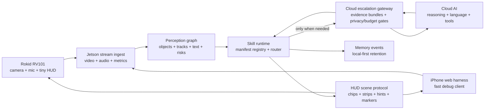
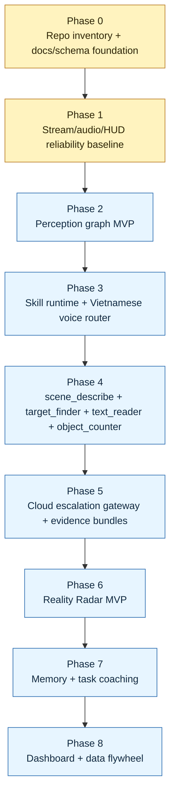

# OpenVision Rokid V2

**OpenVision Rokid V2** is a local-first, real-world AI Skill OS for smart glasses. Rokid RV101 glasses stay lightweight as the user's eyes, ears, and tiny HUD; Jetson owns realtime perception, skill execution, session telemetry, and HUD authority; cloud AI is used as typed escalation for hard reasoning, language, web/file tools, and ambiguous visual verification.

The product goal is not to turn glasses into a phone or stream everything to the cloud. The goal is to make small visual cues feel powerful: "yellow shirt on the left", "3 vehicles ahead", "text says 12V DC", "next step: plug in the red wire", or "your keys may be on the desk".

## North Star

```text
Rokid = camera + microphone + tiny HUD
Jetson = media gateway + perception graph + skill runtime + HUD authority
Cloud AI = typed escalation for hard reasoning, language, tools, and visual verification
```

OpenVision Rokid V2 should help the user answer five physical-world questions:

- What am I seeing?
- Where is the thing I need?
- What should I pay attention to?
- What should I do next?
- What did I see or leave somewhere earlier?

## Capability Families

| Family | Examples |
| --- | --- |
| See | scene description, object detection, counting, OCR, simple scene classification |
| Understand | visual reasoning, anomaly explanation, risk context, object purpose inference |
| Find | target finder, Reality Radar, object/person/attribute search, direction hints |
| Remember | recent event memory, object location memory, session summaries, save points |
| Guide | repair/setup coaching, checklist assistant, step confirmation, next-action hints |

## System Architecture



### Preferred Runtime Flow

```text
stream ingest
  -> perception graph
  -> skill runtime
  -> local answer OR cloud evidence escalation
  -> HUD scene / memory event / replay metric
```

Avoid one-off product endpoints such as `/detect`, `/ask`, `/read`, or `/radar` as the main architecture. Capabilities should be typed skills consuming shared context and emitting structured results.

## Current Stage

The project is transitioning between:

```text
Phase 0: repo inventory + docs/schema foundation
Phase 1: stream/audio/HUD reliability baseline
```

The latest implementation playbook is `docs/openvision/18_IMPLEMENTATION_PLAYBOOK.md`. It defines the near-term PR sequence:

- PR 1.1: strengthen session scorecard gates.
- PR 1.2: add stream metrics baseline.
- PR 1.3: add audio metrics baseline.
- PR 1.4: add HUD baseline validation.
- Then move to Phase 2 perception graph hardening.

Implemented foundation:

- Jetson FastAPI service.
- RV101 split TCP H.264/PCM ingest.
- iPhone WebRTC simulator bridge.
- Event/session trace.
- HUD authority and HUD scene contracts.
- Perception graph scaffolding.
- Manifest-backed skill registry foundation.
- Typed skill executor foundation.
- OpenAI Realtime bridge as the current live cloud AI channel.
- Optional PhoWhisper Debug STT sidecar for operator visibility.
- Ops Console surfaces.
- Shared JSON schemas for HUD, skills, perception, cloud evidence/results, memory, replay, and scorecards.
- In-memory session replay and scorecard skeleton.
- Deploy/check scripts and backend tests.

Not finished yet:

- Clean buildable V2 Android glasses app.
- Production detector/tracker feeding the perception graph.
- Full manifest-dispatched skill runtime.
- Cloud gateway/evidence-bundle runtime enforcement.
- Durable replay/scorecard CLI tooling.
- Product-quality first skills.
- Fresh RV101 device signoff logs.

## Roadmap



## First Product Skills

The first practical skills should prove the runtime before feature volume grows:

| Skill | Purpose |
| --- | --- |
| `scene_describe` | Return a short scene summary from perception graph and optional cloud reasoning. |
| `target_finder` | Find a person/object by class, color, attribute, text, or location hint. |
| `text_reader` | Read signs, labels, numbers, and short text with local-first OCR. |
| `object_counter` | Count visible objects or people by class/zone. |

The current registry also includes transitional manifests such as `count_people`, `query_scene`, `search_targets`, `select_target`, `analyze_selected_target`, and `clear_target` while the product skill layer hardens.

## Key Runtime Contracts

| Contract | Purpose |
| --- | --- |
| `perception_graph` | Shared world state: objects, tracks, text, risks, zones, evidence refs, metrics. |
| `skill_manifest` | Declares inputs, outputs, latency class, local/cloud behavior, privacy level, tests, and failures. |
| `hud_scene` | Compact display protocol for answer strips, status chips, direction hints, target markers, alerts, and progress cues. |
| `cloud_evidence_bundle` | Typed, minimal evidence sent to cloud only when local evidence is insufficient and privacy/budget policy allows. |
| `cloud_result` | Structured cloud answer that Jetson can validate before updating HUD, skill state, or memory. |
| `memory_event` | Privacy-aware saved event/object/location memory. |
| `session_replay` | Redacted bundle for debugging and regression replay. |
| `session_scorecard` | Measurable health summary for stream, audio, perception, skill, cloud, and HUD paths. |

## Repository Layout

```text
.
|-- glasses/               # RV101 thin-client contract and future Android V2 module
|-- iphone_web_simulator/  # Browser/iPhone harness that mirrors the glasses contract
|-- jetson/                # Jetson runtime, media ingest, perception, skills, HUD, Ops Console
|-- shared/schemas/        # JSON schemas for runtime contracts
|-- docs/openvision/       # Public V2 architecture and roadmap docs
|-- ops/                   # Deployment examples, systemd unit, redacted env template
`-- scripts/               # Local checks, bootstrap, deploy, and secret setup helpers
```

## Jetson Runtime Modules

```text
jetson/
|-- agent/             # FastAPI app, settings, sessions, replay/scorecard, control plane
|-- media_gateway/     # RV101 TCP ingest, simulator media bridge, preview store
|-- audio_turns/       # PCM metrics and audio turn handling
|-- perception/        # Perception graph and Rokid-specific YOLO26 adapter boundary
|-- skills/            # Manifest-backed skill registry and executor foundation
|-- hud_authority/     # HUD scene generation and result policy
|-- realtime_agent/    # OpenAI Realtime bridge used as current live cloud AI channel
|-- simulator_bridge/  # WebRTC simulator bridge
|-- lab_fallbacks/     # Optional sidecars such as Debug STT
|-- web_ui/            # Ops Console frontend
`-- tests/             # V2 backend tests
```

## Reality Radar MVP

Reality Radar is the ambitious but practical demo for V2. The user says a natural-language target, such as "find the person wearing a yellow shirt" or "find the red screwdriver". Jetson narrows candidates using local perception, escalates only uncertain evidence to cloud verification, then renders a tiny direction hint or target marker.

MVP scope:

- person by clothing color;
- common object by class;
- text target from OCR;
- direction hint;
- target marker when a bounding box is available;
- cloud verification for ambiguous candidates only.

## Privacy And Safety

OpenVision Rokid sees the real world, so default behavior should be:

- local-first processing;
- minimal retention;
- explicit cloud escalation;
- clear deletion/export path;
- no hidden identity tracking;
- anonymous person tracking by default;
- small HUD output that avoids distraction and overclaiming.

Sensitive content such as faces, children, license plates, private documents, personal screens, homes, and medical/legal/financial information should prefer local processing and require explicit permission before cloud escalation.

## Verification

V2 backend:

```bash
./scripts/check_v2.sh
```

Current public export was verified with the local V2 Python environment because the export intentionally does not include `.venv`.

## Security

This repository should not contain API keys, private service credentials, SSH keys, keystores, raw logs, or debug bundles with sensitive media. Runtime secrets belong in environment variables or ignored local secret files. Public examples use placeholders only.
