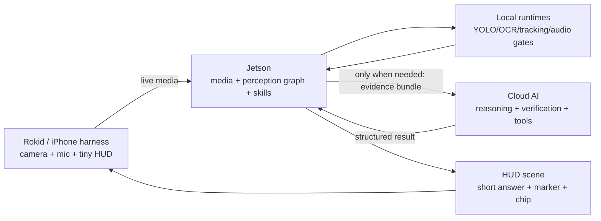

# OpenVision Rokid

OpenVision Rokid V2 is a cloud-realtime-orchestrated, Jetson-executed AI Skill OS for Rokid smart glasses.

```text
Rokid glasses = eyes + ears + tiny HUD
Cloud Realtime AI = conversation brain + typed tool/skill orchestrator
Jetson = local perception executor + skill runtime + media/display/privacy authority
```

The active goal is not to rebuild v1 with cleaner folders. The goal is a product-grade wearable system where Cloud Realtime chooses typed skills/tools, Jetson turns live reality into validated perception and skill execution, and Rokid renders compact HUD scenes.

This is not a Radar-only product. Reality Radar is a flagship Find skill that
should run on the same Skill OS as scene description, OCR, counting,
known-person reminders, memory, and task coaching. If a feature bypasses the
shared runtime just to make Radar work, it is architectural drift.

## Canonical Docs

Read these first:

1. [AGENTS.md](/Users/tranquocnhat/Documents/codex/rokid/AGENTS.md)
2. [docs/openvision/00_INDEX.md](/Users/tranquocnhat/Documents/codex/rokid/docs/openvision/00_INDEX.md)
3. [PROJECT_MEMORY.md](/Users/tranquocnhat/Documents/codex/rokid/PROJECT_MEMORY.md)
4. [ROKID_CURRENT_STATE.md](/Users/tranquocnhat/Documents/codex/rokid/ROKID_CURRENT_STATE.md)
5. [ROKID_CODEX_EXECUTION_PACK.md](/Users/tranquocnhat/Documents/codex/rokid/ROKID_CODEX_EXECUTION_PACK.md)
6. [OpenVision rokid/README.md](/Users/tranquocnhat/Documents/codex/rokid/OpenVision%20rokid/README.md)

`docs/openvision/` is the source of truth for philosophy, architecture, schemas, roadmap, acceptance tests, and Codex prompts.

## Product Loop



## Repository Layout

- [OpenVision rokid](/Users/tranquocnhat/Documents/codex/rokid/OpenVision%20rokid) - active V2 product foundation.
- [docs/openvision](/Users/tranquocnhat/Documents/codex/rokid/docs/openvision) - canonical V2 guidance pack.
- [.github/codex/prompts](/Users/tranquocnhat/Documents/codex/rokid/.github/codex/prompts) - phase prompts for future Codex runs.
- [docs/reference](/Users/tranquocnhat/Documents/codex/rokid/docs/reference) - supporting historical protocol/HUD notes only.
- [RokidVideoStream](/Users/tranquocnhat/Documents/codex/rokid/legacy_quarantine/2026-04-29/RokidVideoStream) - legacy RV101 app reference.
- [rokidjetson/backend_mvp](/Users/tranquocnhat/Documents/codex/rokid/legacy_quarantine/2026-04-29/rokidjetson/backend_mvp) - legacy backend reference.

## Current V2 Status

V2 currently has:

- Jetson FastAPI service foundation;
- RV101 TCP H.264/PCM ingest;
- iPhone WebRTC simulator harness;
- typed skill executor;
- HUD authority and scene contracts;
- perception graph scaffolding;
- Ops Console with preview, trace, settings, and HUD mirror;
- OpenAI Realtime bridge as current live cloud AI channel;
- optional Debug STT sidecar for operator visibility;
- deploy/check scripts and tests.

Still pending:

- buildable clean V2 Android glasses module;
- production perception graph fed by real detector/tracker outputs;
- manifest-driven skill runtime hardening;
- cloud gateway/evidence-bundle enforcement;
- first product skills: `scene_describe`, `target_finder`, `text_reader`, `object_counter`;
- fresh RV101 device validation logs.

## Rules That Matter Most

- Keep Rokid thin.
- Keep Jetson central.
- Use cloud only through typed escalation.
- Every skill uses shared schema and HUD scene protocol.
- Do not touch Ring/YOLO26 security runtime.
- Do not commit secrets or private config.
- Do not grow simulator-only product behavior.
- Do not keep failed experiments in active code/docs.

## Checks

V2 backend:

```bash
cd "OpenVision rokid"
./scripts/check_v2.sh
```

Legacy Android check only when intentionally touching `legacy_quarantine/2026-04-29/RokidVideoStream`:

```bash
cd legacy_quarantine/2026-04-29/RokidVideoStream
./gradlew assembleDebug
./gradlew testDebugUnitTest
```
