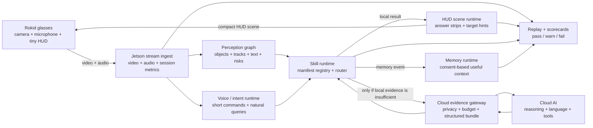
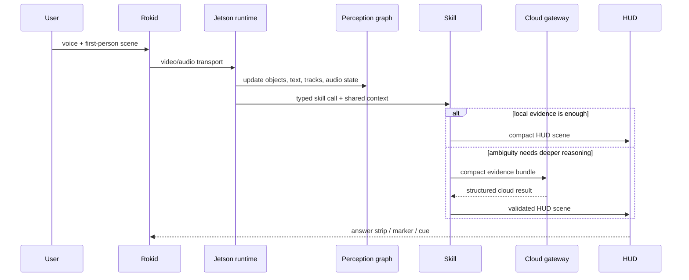
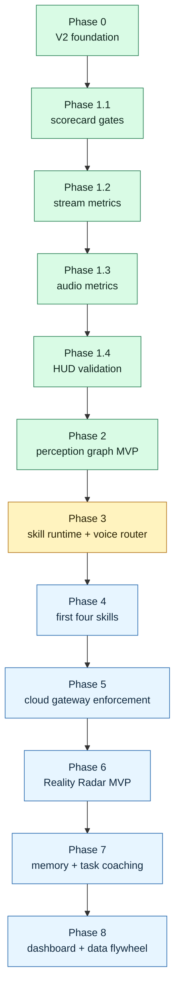

# OpenVision Rokid

> **A real-world AI skill OS for Rokid smart glasses, powered by Jetson edge AI and cloud reasoning.**

OpenVision Rokid is an experimental, edge-first AI glasses project that turns Rokid smart glasses into a lightweight **eyes + ears + HUD** interface, while an NVIDIA Jetson Orin Nano Super acts as the local perception brain and cloud AI acts as a deeper reasoning layer only when needed.

The goal is not to build another phone-like assistant on a pair of glasses. The goal is to build a practical, expandable runtime for **real-world AI skills**: seeing, reading, finding, counting, remembering, guiding, and explaining what is happening around the user in near real time.

## Short Version

OpenVision Rokid treats the glasses as a thin real-world interface and the Jetson as the local runtime. The system should understand the current scene, route intent into typed skills, answer locally when confidence is high, and escalate compact evidence to cloud AI only when deeper reasoning is useful.

---

## Project Status

This repository is moving from a V1 prototype into a V2 architecture.

V1 proved that the core hardware path is possible:

- Rokid glasses can stream first-person video.
- Jetson can receive and process the stream.
- Voice input can reach a transcription/runtime path.
- A minimal HUD path can be controlled from the edge system.
- Local AI models can be used as part of the perception stack.

V2 changes the direction from “AI assistant demo” to **OpenVision Skill OS**:

```text
Rokid glasses  ->  capture + transport + tiny HUD
Jetson edge AI ->  realtime perception + skill routing + local memory
Cloud AI       ->  deep reasoning + language + tools + verification
```

| Earlier prototype thinking | V2 Skill OS direction |
|---|---|
| One-off AI assistant demo | Shared runtime for many real-world skills |
| Cloud as the main intelligence path | Jetson local-first; cloud only when useful |
| Direct feature endpoints | `perception_graph` -> skill runtime -> HUD/memory/cloud gateway |
| Manual demo validation | Replay and scorecards before claiming improvement |
| Rich UI on glasses | Tiny HUD cues that keep the user present |

This is an active research/build project. Expect rapid iteration, hardware-specific constraints, and incomplete modules while the V2 runtime is being implemented.

---

## Current Build Checkpoint

The active public direction is **V2 local-first Skill OS**.

```text
Current phase: Phase 3 — Skill Runtime + Vietnamese Voice Router
Completed foundation: Phase 0 docs/schemas, Phase 1 reliability baseline, Phase 2 perception graph MVP
Current checkpoint: skill runtime hardening and Realtime tool discipline
Next checkpoint: manifest-backed dispatch, Vietnamese local routing, and cloud-gateway enforcement
```

Recent public progress:

- Stream, audio, HUD, replay, and scorecard baselines are now measurable.
- Perception graph snapshots now include zones, frame dimensions, object ages, and temporal continuity.
- YOLO26 reuse is isolated behind a disabled-by-default Rokid/OpenVision adapter.
- Realtime handling now preserves richer HUD output, schedules tool calls off the receive loop, supports optional voice output, and surfaces output-audio transcripts.
- Debug STT is still sidecar-only, with lifecycle/auth hardening and mini PC helper scripts.
- A cloud evidence gateway foundation now validates bundles/results, enforces privacy and request budget gates, and falls back safely when no verifier is configured.

The immediate rule for the project is:

```text
If a session cannot be replayed and scored, do not call it improved.
```

---

## Why This Exists

Most smart-glasses projects fall into one of two traps:

1. **Phone-on-your-face UI**: too much interface, too much menu navigation, too much distraction.
2. **Cloud-everything AI**: expensive, high-latency, privacy-sensitive, and fragile when network quality drops.

OpenVision Rokid takes a different path:

- Keep the glasses thin and focused.
- Run fast perception on the Jetson.
- Use cloud AI selectively, not continuously.
- Convert visual/audio input into a shared `perception_graph`.
- Let skills consume that graph instead of each skill building its own pipeline.
- Return tiny, timely HUD/voice cues instead of long answers by default.

The long-term ambition is simple:

> Build a practical AI layer for the physical world.

---

## What This Project Is

OpenVision Rokid is designed to become:

- A **voice-first AI glasses runtime**.
- A **local-first perception system** for first-person video.
- A **skill runtime** where new real-world skills can be added without rewriting the whole stack.
- A **cloud-augmented reasoning system** that sends compact evidence bundles instead of streaming everything to the cloud.
- A **privacy-aware memory system** for useful personal context, not uncontrolled surveillance.
- A **developer platform** for experimenting with edge AI, vision-language systems, and wearable interaction.

## What This Project Is Not

This project is intentionally not:

- A full AR/metaverse UI.
- A phone app squeezed onto glasses.
- A cloud-only video analysis service.
- A general surveillance or face-identification system.
- A model benchmark repo with no real-world interaction layer.
- A collection of disconnected demos with no shared runtime.

---

## North Star

```text
OpenVision Rokid is a real-world AI skill OS:
Rokid captures the world,
Jetson understands it locally,
cloud AI reasons deeply when needed,
and the user receives tiny, useful cues at the right moment.
```

Core product words:

```text
See. Understand. Find. Remember. Guide.
```

Example interactions:

```text
"What am I looking at?"
"Read this label."
"Count the cars in front of me."
"Find my red screwdriver."
"Remind me where I left this object."
"Guide me through this setup step by step."
"Is there anything important I should notice?"
```

Expected output should usually be short:

```text
"3 cars ahead."
"Label: 12V DC."
"Red screwdriver: left side of table."
"Next step: connect the USB-C cable."
```

---

## System Architecture



The architecture is built around one rule:

> Skills do not own the system. The runtime owns the system.

Every skill should consume shared state and produce structured outputs.

### Responsibility Split

| Layer | Owns | Avoids |
|---|---|---|
| Rokid glasses | capture, audio, transport, tiny HUD | heavy AI, complex menus, long panels |
| Jetson | stream ingest, perception graph, skill runtime, HUD authority, replay | scattering logic across isolated demos |
| Cloud AI | deeper reasoning, language, tools, verification | continuous raw video by default |
| Dashboard | observability, scorecards, debug visibility | becoming the product UI |

---

## Core Runtime Layers

### 1. Rokid Layer

Rokid glasses should stay lightweight:

- Capture first-person video.
- Capture microphone audio.
- Send streams to the Jetson.
- Receive compact HUD scenes.
- Avoid heavy AI and complex UI decisions on the glasses.

Design principle:

```text
Rokid = eyes + ears + tiny HUD
```

### 2. Jetson Edge Layer

The Jetson should be the primary local brain:

- Video ingest.
- Audio ingest.
- Object detection.
- Object tracking.
- Lightweight OCR.
- Voice activity detection.
- Local command routing.
- Perception graph generation.
- Skill runtime execution.
- HUD scene authority.
- Session logging and replay.

Design principle:

```text
Jetson = realtime perception brain + skill router
```

The target hardware is the **NVIDIA Jetson Orin Nano Super**, which NVIDIA lists with up to **67 INT8 TOPS**, **8GB LPDDR5**, **102 GB/s memory bandwidth**, and a **7W–25W** power range. This makes it suitable for fast edge vision and small multimodal workloads, but still memory-constrained enough that large models must be scheduled carefully.

### 3. Cloud AI Layer

Cloud AI should be used as an escalation layer, not the default pipeline:

- Complex visual reasoning.
- Hard OCR or scene understanding.
- Natural conversation.
- Web search.
- File search.
- Tool calling.
- Long-form explanation.
- Code/debugging workflows.
- Verification when local confidence is low.

Design principle:

```text
Cloud AI = deep reasoning + tools + verification
```

Cloud requests should be compact and structured. The Jetson should send an `evidence_bundle`, not a continuous raw video stream.

### 4. Dashboard / Control Plane

The project needs a control plane for observability:

- Session timeline.
- Audio health.
- Video FPS and latency.
- Detector FPS.
- GPU/RAM/temperature.
- Skill activation logs.
- Cloud call rate.
- HUD events.
- Perception graph snapshots.
- Replay and scorecards.

Without measurement, the project will become hard to debug and easy to overfit to demos.

---

## Runtime Contracts That Keep V2 From Drifting

V2 is organized around structured contracts. The four core contracts below define the main product loop; supporting contracts such as `session_replay`, `session_scorecard`, `cloud_result`, and `memory_event` make the runtime measurable and extensible.

### 1. `perception_graph`

A shared representation of what the system currently believes about the world.

Example:

```json
{
  "version": 1,
  "timestamp_ms": 123456789,
  "scene": {
    "label": "workbench",
    "confidence": 0.74
  },
  "objects": [
    {
      "id": "obj_12",
      "class": "screwdriver",
      "box": [0.12, 0.45, 0.28, 0.72],
      "confidence": 0.86,
      "attributes": {
        "color": "red"
      },
      "track_age_ms": 4200
    }
  ],
  "text_regions": [
    {
      "content": "12V DC",
      "box": [0.5, 0.3, 0.7, 0.42],
      "confidence": 0.81
    }
  ],
  "audio": {
    "last_transcript": "read this label",
    "language": "en"
  }
}
```

### 2. `skill_manifest`

Every skill must declare its inputs, outputs, privacy level, cloud permissions, and latency class.

Example:

```json
{
  "id": "text_reader",
  "name": "Text Reader",
  "latency_class": "interactive",
  "inputs": ["transcript", "perception_graph", "keyframe"],
  "outputs": ["hud_scene", "voice_reply"],
  "local_first": true,
  "cloud_allowed": true,
  "privacy_level": "normal",
  "activation_phrases": [
    "read this",
    "read the label",
    "đọc dòng chữ này"
  ]
}
```

### 3. `hud_scene`

The glasses should receive small display instructions, not business logic.

Example:

```json
{
  "version": 1,
  "type": "target_hint",
  "text": "Red screwdriver · left side",
  "anchor": "left_front",
  "duration_ms": 1800,
  "priority": "normal"
}
```

### 4. `cloud_evidence_bundle`

The Jetson sends compact evidence when local perception is not enough.

Example:

```json
{
  "version": 1,
  "user_query": "What does this label mean?",
  "local_context": {
    "scene": "workbench",
    "objects": ["battery", "charger", "label"]
  },
  "images": [
    {
      "type": "keyframe",
      "path": "session_001/keyframes/frame_1042.jpg"
    }
  ],
  "requested_output": "short_hud_answer"
}
```

---

## Skill Runtime

The skill runtime is the heart of V2.

A skill should not directly own the camera, microphone, HUD, memory, and cloud API at the same time. Instead, each skill should operate through the runtime:



```text
transcript + perception_graph + optional keyframe
        ↓
skill router
        ↓
local skill execution
        ↓
optional cloud escalation
        ↓
hud_scene + voice_reply + memory_event
```

### First Four Practical Skills

The first production-minded skills should be:

| Skill | Purpose | Local-first? | Cloud escalation? |
|---|---|---:|---:|
| `scene_describe` | Describe what the user is looking at | Yes | Yes |
| `target_finder` | Find an object or approved target in view | Yes | Yes |
| `text_reader` | Read visible labels/signs/text | Yes | Yes |
| `object_counter` | Count objects such as cars, tools, boxes | Yes | Rarely |

These four skills prove the platform without making the project too wide too early.

### Ambitious Skill: Reality Radar

Reality Radar is the flagship V2 concept.

It lets the user say things like:

```text
"Find my red screwdriver."
"Where is the blue bag?"
"Show me the item I was using earlier."
"Highlight the label I should read."
```

The runtime should:

1. Parse the user goal.
2. Use the perception graph to shortlist candidates.
3. Track candidates across frames.
4. Escalate only ambiguous crops/keyframes to cloud AI.
5. Return a tiny HUD cue.

Example HUD output:

```text
"Red screwdriver · left side"
```

Privacy boundary:

- Reality Radar should focus on objects, tools, signs, places, and user-approved targets.
- Person tracking, face recognition, or identity inference must not be enabled by default.
- Any sensitive memory feature must be consent-based and deletable.

---

## Jetson Skills vs Cloud AI Skills

### Best on Jetson

These should run locally whenever possible:

- Frame ingest.
- Object detection.
- Object tracking.
- Lightweight pose/keypoint detection.
- Lightweight OCR.
- Voice activity detection.
- Short command routing.
- HUD scene generation.
- Short-term session memory.
- Benchmarking and replay.

### Best in Cloud AI

These should be escalated only when needed:

- Complex visual reasoning.
- Ambiguous object/text interpretation.
- Natural conversation.
- Web-grounded answers.
- File/project memory search.
- Multi-step planning.
- Code/debugging assistance.
- Long-form explanation.

### Cloud Escalation Rule

```text
If local confidence is high:
  answer locally.

If local confidence is low but evidence is compact:
  send evidence_bundle to cloud AI.

If request is not time-sensitive:
  batch, cache, or defer cloud work.

Never stream everything by default.
```

---

## Public Repository Structure

The current public repository is organized around the V2 runtime contracts:

```text
openvision-rokid/
  README.md

  docs/openvision/
    00_INDEX.md
    01_NORTH_STAR_AND_PHILOSOPHY.md
    02_SYSTEM_ARCHITECTURE.md
    03_V1_LESSONS_TO_PRESERVE.md
    04_JETSON_EDGE_SKILLS.md
    05_CLOUD_AI_SKILLS.md
    06_SKILL_RUNTIME_AND_REGISTRY.md
    07_PERCEPTION_GRAPH.md
    08_HUD_SCENE_PROTOCOL.md
    09_CLOUD_ESCALATION_GATEWAY.md
    10_REALITY_RADAR_MVP.md
    11_PRIVACY_MEMORY_SAFETY.md
    12_BENCHMARKING_AND_REPLAY.md
    13_ROADMAP_AND_PR_SEQUENCE.md
    15_DO_NOT_BUILD_YET.md
    16_ACCEPTANCE_TESTS.md
    17_REPO_INVENTORY.md
    18_IMPLEMENTATION_PLAYBOOK.md
    schemas/

  jetson/
    agent/             FastAPI app, control plane, sessions, replay, scorecards
    media_gateway/     RV101 TCP ingest and simulator media state
    audio_turns/       audio signal metrics and turn handling
    perception/        perception graph and isolated detector adapters
    skills/            skill manifests, registry, executor foundation
    hud_authority/     HUD scene construction and policy
    realtime_agent/    current live cloud bridge
    simulator_bridge/  WebRTC simulator bridge
    lab_fallbacks/     optional debug sidecars
    web_ui/            Ops Console frontend
    tests/             backend test suite

  shared/schemas/      JSON schemas for sessions, skills, HUD, cloud, memory
  glasses/             RV101 thin-client contract and future Android V2 module
  iphone_web_simulator/ browser/iPhone debug harness
  ops/                 deployment examples and redacted environment templates
  scripts/             check, bootstrap, and deploy helpers
```

---

## Development Roadmap



Current public checkpoint:

| Track | Status |
|---|---|
| Phase 0 V2 foundation | Done |
| Phase 1.1 structured scorecard gates | Done |
| Phase 1.2 stream metrics baseline | Done |
| Phase 1.3 audio metrics baseline | Done |
| Phase 1.4 HUD validation | Done |
| Phase 2 perception graph MVP | Done |
| Cloud gateway foundation | Landed |
| Phase 3 skill runtime + voice router | Current |
| Phase 4 first practical skills | Next |

### Phase 0 — V2 Foundation

Goal: make the repo understandable and hard to misdirect.

- Add V2 architecture docs.
- Add schema docs.
- Add repo inventory.
- Define acceptance tests.

### Phase 1 — Reliability Baseline

Goal: verify the basic hardware loop.

- Rokid video stream stable.
- Rokid microphone path stable.
- Jetson backend health checks.
- HUD send/receive loop.
- Session logging.
- Basic replay/scorecard scripts.

### Phase 2 — Perception Graph MVP

Goal: create one shared world state.

- Object detections.
- Track IDs.
- Optional OCR regions.
- Scene snapshots.
- Timestamps and confidence.
- JSON schema validation.

### Phase 3 — Skill Runtime + Voice Router

Goal: stop building disconnected features.

- Skill registry.
- Skill manifests.
- Intent router.
- Skill input/output contract.
- First local skill execution path.

### Phase 4 — First Four Skills

Goal: prove practical value.

- `scene_describe`
- `target_finder`
- `text_reader`
- `object_counter`

### Phase 5 — Cloud Escalation Gateway

Goal: use cloud AI intelligently.

- One gateway for all cloud calls.
- Evidence bundle schema.
- Structured cloud result schema.
- Rate limits.
- Caching.
- Privacy filters.

### Phase 6 — Reality Radar MVP

Goal: build the flagship experience.

- Natural target query.
- Candidate matching.
- Tracking.
- Local confidence scoring.
- Cloud verification for ambiguous cases.
- Tiny HUD directional cue.

### Phase 7 — Memory + Task Coaching

Goal: make the system useful over time.

- Consent-based memory events.
- Object/location recall.
- Task checklists.
- Step-by-step guidance.
- Deletion/export controls.

### Phase 8 — Dashboard + Data Flywheel

Goal: improve the system through real usage.

- Session scorecards.
- Failure clustering.
- Model/runtime benchmarks.
- Human-reviewed event labeling.
- Skill evaluation dashboards.

---

## Getting Started

This project is hardware-dependent. The exact setup may change as V2 lands.

### Hardware

Recommended:

- Rokid smart glasses.
- NVIDIA Jetson Orin Nano Super Developer Kit.
- Stable local Wi-Fi or direct network path between glasses and Jetson.
- Optional external storage for session logs and model assets.

### Software

Recommended:

- JetPack / Jetson Linux compatible with your Jetson setup.
- Python 3.10+ for Jetson services.
- Android Studio / Gradle for Rokid Android app development.
- Optional Docker for reproducible service environments.
- Optional cloud AI API keys for transcription, reasoning, and tool use.

### Clone

```bash
git clone https://github.com/tranquocnhat94/openvision-rokid.git
cd openvision-rokid
```

### First Development Task

Before adding new features, run or create a repo inventory:

```text
1. Find current Rokid app paths.
2. Find current Jetson service paths.
3. Find current model/runtime paths.
4. Find current cloud API call locations.
5. Find current HUD output locations.
6. Check whether perception graph exists.
7. Check whether skill registry exists.
8. Check whether replay/scorecard tools exist.
```

The first engineering goal is not a flashy demo. The first engineering goal is a reliable runtime.

---

## Verification

The backend check is the public baseline for V2 changes:

```bash
python3 -m venv .venv
. .venv/bin/activate
pip install -r jetson/agent/requirements.txt
./scripts/check_v2.sh
```

The project should not claim real-device success without fresh device logs. `.venv`, runtime secrets, logs, media captures, and debug bundles are intentionally not committed.

---

## Development Workflow

The project should grow through small, measurable runtime improvements. Preferred implementation order:

```text
1. Docs + schemas foundation
2. Reliability baseline
3. Perception graph MVP
4. Skill runtime MVP
5. HUD scene protocol
6. First four skills
7. Cloud gateway
8. Reality Radar MVP
9. Replay + scorecard tooling
```

Engineering guardrails:

- Do not turn the glasses into a complex UI surface.
- Do not scatter cloud calls across random files.
- Do not add a skill that bypasses the skill runtime.
- Do not add memory without privacy controls.
- Do not make Reality Radar depend on raw continuous cloud video.
- Do not optimize model performance before adding benchmark/replay tools.
- Do not break known-good V1 hardware paths without a rollback plan.

---

## Privacy and Safety Principles

OpenVision Rokid deals with first-person video and audio. That makes privacy a core architecture concern, not an afterthought.

Principles:

- Local-first by default.
- Cloud only when useful and justified.
- Send compact evidence, not continuous raw video.
- Avoid identity inference by default.
- Do not enable face recognition as a default feature.
- Make memory opt-in, inspectable, and deletable.
- Log enough to debug, but avoid storing sensitive data unnecessarily.
- Design HUD output to assist the user without distracting them.

This project should be used for constructive, assistive, educational, and productivity-oriented applications.

---

## Example Skill Ideas

### Practical Near-Term Skills

- Scene description.
- Object counting.
- Text reading.
- Label reading.
- Tool/object finder.
- Simple navigation cues.
- Task checklist assistant.
- Setup/repair guide.
- Session summary.

### Ambitious Long-Term Skills

- Reality Radar.
- Personal object memory.
- Visual debugging assistant for hardware projects.
- Field copilot for makers, repair work, and technical setup.
- Multi-modal project assistant that connects what the user sees with project docs.
- First-person data flywheel for improving local skills through replay and evaluation.

---

## Evaluation Metrics

Every serious session should measure:

- Camera FPS.
- End-to-end frame latency.
- Detector FPS.
- Tracker stability.
- GPU utilization.
- RAM usage.
- Jetson temperature.
- Audio RMS / voice activity.
- STT latency.
- Intent routing accuracy.
- Skill success rate.
- Cloud calls per minute.
- HUD latency.
- User-visible response time.
- Failure reason.

A skill is not “done” until it can be replayed, measured, and compared against previous runs.

---

## Security

This repository should not contain API keys, private service credentials, SSH keys, keystores, raw logs, or debug bundles with sensitive media. Runtime secrets belong in environment variables or ignored local secret files. Public examples should use placeholders only.

---

## Contributing

Contributions should strengthen the V2 runtime instead of adding isolated demos.

Good contributions:

- Improve stream reliability.
- Add benchmark/replay tools.
- Add schema validation.
- Improve perception graph quality.
- Add a skill through the skill registry.
- Improve HUD protocol clarity.
- Improve cloud gateway safety and caching.
- Improve documentation and test coverage.

Avoid contributions that:

- Add complex UI directly to the glasses.
- Bypass the skill runtime.
- Call cloud APIs from many unrelated places.
- Store sensitive memory without controls.
- Optimize for one demo at the cost of architecture.

---

## Community Vision

OpenVision Rokid is for people interested in:

- Edge AI.
- Smart glasses.
- First-person perception.
- Multimodal AI.
- Human-computer interaction.
- Assistive tools.
- Jetson robotics/vision systems.
- Wearable AI skill design.
- Practical AI systems in the physical world.

The project’s ambition is big, but the build path is grounded:

```text
Make the hardware loop reliable.
Represent the world as a perception graph.
Route user intent into skills.
Keep the HUD tiny.
Escalate to cloud only when useful.
Measure everything.
```

---

## References

- [NVIDIA Jetson Orin Nano Super Developer Kit](https://www.nvidia.com/en-us/autonomous-machines/embedded-systems/jetson-orin/nano-super-developer-kit/)
- [Rokid Glass Documentation](https://rokid.github.io/glass-docs/)
- [OpenAI Realtime API / gpt-realtime](https://platform.openai.com/docs/models/gpt-realtime)

---

## License

License information should be defined by the repository owner.

If this repository is intended to be open source, add a clear license file such as `MIT`, `Apache-2.0`, or another license appropriate for the project.

---

## One-Sentence Summary

**OpenVision Rokid is an edge-first AI glasses platform that turns first-person vision and voice into practical real-world skills, using Rokid as the interface, Jetson as the local brain, and cloud AI as the reasoning layer when local perception is not enough.**
