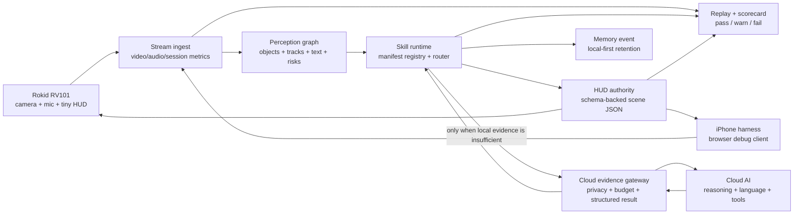
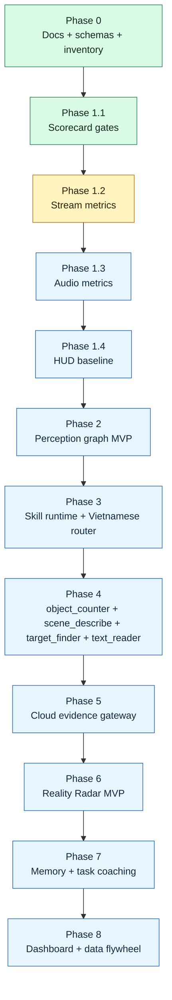

# OpenVision Rokid V2

**OpenVision Rokid V2 is now a local-first AI Skill OS for smart glasses.**

This repository is not being built as a Realtime-first demo, a phone UI on glasses, or a bundle of separate AI endpoints. The current direction is a measured runtime platform:

```text
Rokid RV101
  -> live camera + microphone + tiny HUD
  -> Jetson stream ingest
  -> perception graph
  -> manifest-driven skill runtime
  -> local answer OR cloud evidence gateway
  -> HUD scene + replay/scorecard
```

Jetson is the realtime authority. Cloud AI is escalation. The glasses stay thin.

## What Changed

| Earlier direction | Current V2 direction |
| --- | --- |
| OpenAI Realtime as the main live brain | Jetson local-first skill runtime; Realtime is only the current cloud/live bridge |
| Build impressive skills quickly | First make streams, audio, HUD, replay, scorecards, schemas, and skill boundaries measurable |
| Cloud reasoning from wherever a feature needs it | One cloud evidence gateway with privacy/budget checks and structured results |
| One-off endpoints such as detect/read/ask/radar | Shared perception graph -> skill runtime -> HUD scene/cloud gateway/memory event |
| Debug panels and manual testing | Session replay and scorecard gates decide pass/warn/fail |
| Old mode-style product thinking | Manifest-driven skills with typed inputs, outputs, latency class, privacy level, tests, and failure modes |

## Current Public Checkpoint

The project is between **Phase 0** and **Phase 1**.

Phase 0 foundation is in place:

- V2 architecture docs under `docs/openvision/`.
- Shared JSON schemas for runtime contracts.
- Manifest-driven skill registry foundation.
- Perception snapshot MVP.
- HUD authority MVP.
- In-memory session replay and scorecard skeleton.
- RV101 TCP ingest skeleton.
- iPhone WebRTC harness.
- OpenAI Realtime bridge as the current live cloud channel.
- Optional Debug STT sidecar.
- YOLO26 adapter disabled by default.
- Backend test suite.

Phase 1 has started:

- **PR 1.1 structured scorecard gates is done** in the current V2 source.
- Next public/runtime work is PR 1.2: stream metrics baseline.
- Then PR 1.3 audio metrics baseline.
- Then PR 1.4 HUD baseline validation.

The active implementation checklist lives in:

```text
docs/openvision/18_IMPLEMENTATION_PLAYBOOK.md
```

## Current Build Priority

Do not start by adding many flashy skills. First make the platform measurable:

```text
1. scorecard gates
2. stream metrics
3. audio metrics
4. HUD baseline
5. perception graph hardening
6. skill runtime/router
7. cloud evidence gateway
8. first four practical skills
```

This is the near-term product rule:

```text
If a session cannot be replayed and scored, do not call it improved.
```

## Runtime Architecture



Preferred flow:

```text
stream ingest
  -> perception graph
  -> skill runtime
  -> local answer OR cloud evidence escalation
  -> HUD scene / memory event / replay metric
```

Anti-pattern:

```text
skill grabs frame -> skill calls cloud -> skill renders custom HUD -> skill logs its own format
```

Preferred pattern:

```text
shared perception graph
  -> shared skill registry
  -> shared cloud gateway
  -> shared HUD scene protocol
  -> shared replay/scorecard
```

## Required Runtime Contracts

| Contract | Status | Purpose |
| --- | --- | --- |
| `session_scorecard` | skeleton + PR 1.1 gates | Tells why a session passed, warned, or failed. |
| `session_replay` | skeleton | Redacted bundle for debugging and regression replay. |
| `perception_graph` | snapshot MVP | Shared world state for visible objects, text, zones, risks, evidence, and metrics. |
| `skill_manifest` | foundation | Declares inputs, outputs, latency class, local/cloud behavior, privacy, tests, and failure modes. |
| `hud_scene` | MVP | Small display protocol for answer strips, status chips, direction hints, target markers, alerts, and progress cues. |
| `cloud_evidence_bundle` | schema only | Compact evidence packet for cloud escalation. |
| `cloud_result` | schema only | Structured cloud response validated by Jetson before HUD/memory updates. |
| `memory_event` | schema only | Privacy-aware object/event/location memory with retention metadata. |

## Roadmap



## First Four Practical Skills

These come after the reliability and runtime primitives are measurable.

| Skill | Local-first behavior | Cloud escalation |
| --- | --- | --- |
| `object_counter` | Count objects/people from perception graph by class and zone. | Avoid unless local evidence is ambiguous. |
| `scene_describe` | Summarize objects, text, risks, and current scene state. | Optional deeper explanation. |
| `target_finder` | Rank local candidates and emit direction/marker HUD. | Verify ambiguous attributes from selected crops only. |
| `text_reader` | Read signs, labels, and short text with local OCR. | Escalate blurry or low-confidence text. |

Reality Radar is later. It should be built from target finder, stable tracking, candidate ranking, cloud verification only for ambiguity, and compact HUD direction hints.

## Repository Layout

```text
.
|-- docs/openvision/       # Current V2 architecture, acceptance tests, implementation playbook
|-- shared/schemas/        # JSON schemas for runtime contracts
|-- jetson/                # Active Jetson V2 runtime
|-- glasses/               # RV101 thin-client contract and future Android V2 module
|-- iphone_web_simulator/  # Browser/iPhone harness
|-- ops/                   # Deployment examples and redacted env templates
`-- scripts/               # Check/bootstrap/deploy helpers
```

Jetson runtime:

```text
jetson/
|-- agent/             # FastAPI app, settings, sessions, replay/scorecard, control plane
|-- media_gateway/     # RV101 TCP ingest, simulator bridge, media state
|-- audio_turns/       # Audio signal metrics and turn handling
|-- perception/        # Perception graph and isolated YOLO26 adapter boundary
|-- skills/            # Skill manifests, registry, executor foundation
|-- hud_authority/     # HUD scene construction and policy
|-- realtime_agent/    # Current OpenAI Realtime bridge
|-- simulator_bridge/  # WebRTC simulator bridge
|-- lab_fallbacks/     # Optional debug sidecars
|-- web_ui/            # Ops Console frontend
`-- tests/             # Backend tests
```

## Not Done Yet

- Durable replay files and CLI scorecard tooling.
- Fresh stream/audio/HUD baseline from iPhone or RV101 sessions.
- Temporal perception graph with stable tracking history.
- Cloud evidence gateway runtime.
- Vietnamese local router.
- Production-quality first four skills.
- Clean buildable V2 Android glasses app.
- RV101 real-device signoff logs for the clean V2 path.

## Design Rules

- Rokid stays thin: capture, microphone, transport, session state, and tiny HUD only.
- Jetson owns realtime perception, skill runtime, HUD authority, replay, and metrics.
- Cloud calls must go through evidence bundles, privacy checks, and budget checks.
- HUD output must be short and schema-backed.
- Skills consume shared context and emit structured results.
- Debug STT is operator visibility only, not command routing.
- YOLO26 reuse must stay in a separate OpenVision/Rokid path and must not touch an existing security runtime.
- Do not claim real-device success without fresh device logs.

## Verification

```bash
python3 -m venv .venv
. .venv/bin/activate
pip install -r jetson/agent/requirements.txt
./scripts/check_v2.sh
```

`.venv`, runtime secrets, logs, and debug bundles are intentionally not committed.

## Security

This repository should not contain API keys, private service credentials, SSH keys, keystores, raw logs, or debug bundles with sensitive media. Runtime secrets belong in environment variables or ignored local secret files. Public examples use placeholders only.
