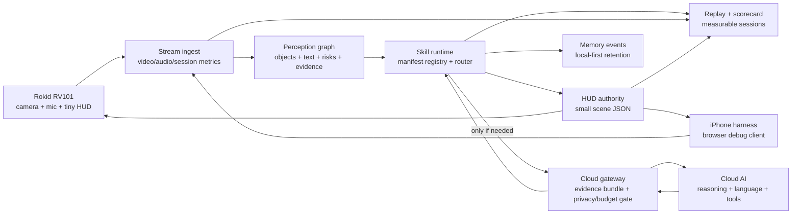
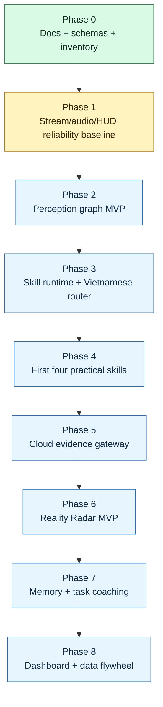

# OpenVision Rokid V2

**OpenVision Rokid V2** is a local-first AI skill runtime for smart glasses.

Rokid RV101 captures reality. Jetson turns the live stream into structured local perception, runs typed skills, decides whether cloud reasoning is needed, and emits tiny HUD scenes. Cloud AI is not the default hot path; it is an escalation layer for ambiguous visual verification, language, web/file/tool work, and deeper reasoning.

```text
Rokid = eyes + ears + tiny HUD
Jetson = realtime perception brain + skill runtime + HUD authority
Cloud AI = typed escalation when local evidence is not enough
```

## What This Project Is

OpenVision Rokid V2 is being built as a practical real-world **AI Skill OS** for smart glasses. It should help the user:

- see what is in front of them;
- understand what matters in the scene;
- find people, objects, text, or targets;
- remember useful real-world events with privacy controls;
- receive short next-step guidance while staying present in the physical world.

It is not a phone UI on glasses, not a full-screen AR dashboard, not a cloud video streaming product, and not a collection of isolated AI demos.

## Current Checkpoint

The project is currently moving from **Phase 0** into **Phase 1**.

Phase 0 is mostly complete:

- V2 guidance docs under `docs/openvision/`.
- Repo inventory and active/legacy path separation.
- Shared JSON schemas.
- Manifest-driven skill registry foundation.
- Perception snapshot MVP.
- HUD authority MVP.
- Session replay and scorecard skeleton.
- RV101 TCP ingest skeleton.
- iPhone WebRTC harness.
- OpenAI Realtime bridge as the current live cloud channel.
- Optional Debug STT sidecar.
- YOLO26 adapter disabled by default.
- Backend tests.

Phase 1 is the next active target:

```text
Prove iPhone/RV101 -> Jetson -> HUD/audio paths are measurable, visible, and scoreable.
```

Immediate PR sequence from `docs/openvision/18_IMPLEMENTATION_PLAYBOOK.md`:

1. Strengthen session scorecard gates.
2. Add stream metrics baseline.
3. Add audio metrics baseline.
4. Add HUD baseline validation.
5. Then continue to Phase 2 perception graph hardening.

## Architecture



Preferred runtime flow:

```text
stream ingest
  -> perception graph
  -> skill runtime
  -> local answer OR cloud evidence escalation
  -> HUD scene / memory event / replay metric
```

The important rule is that individual skills should not each grab frames, call cloud, render HUD, and log in their own private way. They should use the shared perception graph, skill runtime, cloud gateway, HUD scene protocol, and scorecard/replay system.

## Required Runtime Primitives

| Primitive | Why it exists |
| --- | --- |
| `perception_graph` | Shared world state for objects, tracks, text, risks, zones, evidence refs, and metrics. |
| `skill_manifest` | Declares inputs, outputs, latency class, local/cloud policy, privacy level, tests, and failure modes. |
| `hud_scene` | Compact display contract for answer strips, status chips, direction hints, target markers, alerts, and progress cues. |
| `cloud_evidence_bundle` | Minimal structured evidence sent to cloud only when local confidence is insufficient and policy allows it. |
| `cloud_result` | Structured cloud answer that Jetson validates before updating HUD, skill state, or memory. |
| `memory_event` | Privacy-aware event/object/location memory with explicit retention metadata. |
| `session_replay` | Redacted session bundle for debugging and regression replay. |
| `session_scorecard` | Health summary for stream, audio, perception, skill, cloud, HUD, and failure reasons. |

## Roadmap



## First Four Practical Skills

These skills are intentionally small. They prove the platform before feature volume grows.

| Skill | Local-first behavior | Cloud use |
| --- | --- | --- |
| `object_counter` | Count objects/people from perception graph by class and zone. | Avoid unless local evidence is ambiguous. |
| `scene_describe` | Summarize visible objects, text, risks, and scene state. | Optional richer explanation. |
| `target_finder` | Rank local candidates and emit direction/marker HUD. | Verify ambiguous attributes from selected crops only. |
| `text_reader` | Read signs, labels, and short text with local OCR. | Escalate blurry/low-confidence text. |

Reality Radar comes after these foundations. It should be built from target finder, local tracking, candidate ranking, cloud verification for ambiguity, and compact HUD direction hints.

## What Exists In This Repo

```text
.
|-- docs/openvision/       # V2 architecture, roadmap, acceptance tests, implementation playbook
|-- shared/schemas/        # JSON schemas for runtime contracts
|-- jetson/                # Active Jetson V2 runtime
|-- glasses/               # RV101 thin-client contract and future Android V2 module
|-- iphone_web_simulator/  # Browser/iPhone harness
|-- ops/                   # Deployment examples and redacted env templates
`-- scripts/               # Check/bootstrap/deploy helpers
```

Jetson runtime:

```text
jetson/
|-- agent/             # FastAPI app, sessions, settings, replay/scorecard, control plane
|-- media_gateway/     # RV101 TCP ingest, simulator bridge, preview/media state
|-- audio_turns/       # Audio signal metrics and turn handling
|-- perception/        # Perception graph and isolated YOLO26 adapter boundary
|-- skills/            # Skill manifests, registry, executor foundation
|-- hud_authority/     # HUD scene construction and policy
|-- realtime_agent/    # Current OpenAI Realtime bridge
|-- simulator_bridge/  # WebRTC simulator bridge
|-- lab_fallbacks/     # Optional debug sidecars
|-- web_ui/            # Ops Console frontend
`-- tests/             # Backend tests
```

## What Is Not Done Yet

- Durable replay files and CLI scorecard tooling.
- Fresh stream/audio/HUD baseline from iPhone or RV101 sessions.
- Temporal perception graph with stable tracking history.
- Cloud evidence gateway runtime.
- Vietnamese local router.
- Production-quality `object_counter`, `scene_describe`, `target_finder`, and `text_reader`.
- Clean buildable V2 Android glasses app.
- RV101 real-device signoff logs for the clean V2 path.

## Design Rules

- Rokid stays thin: capture, microphone, transport, session state, and tiny HUD only.
- Jetson is the realtime authority for perception, skills, HUD, replay, and metrics.
- Cloud calls go through evidence bundles, privacy checks, and budget checks.
- HUD output stays short and schema-backed.
- Skills consume shared context and emit structured results.
- Debug STT is operator visibility only, not command routing.
- YOLO26 reuse must stay in a separate OpenVision/Rokid path and must not touch an existing security runtime.
- Do not claim real-device success without fresh device logs.

## Verification

Run the V2 backend check:

```bash
./scripts/check_v2.sh
```

The public export is tested using the local V2 Python environment because `.venv` and runtime secrets are intentionally not committed.

## Security

This repository should not contain API keys, private service credentials, SSH keys, keystores, raw logs, or debug bundles with sensitive media. Runtime secrets belong in environment variables or ignored local secret files. Public examples use placeholders only.
