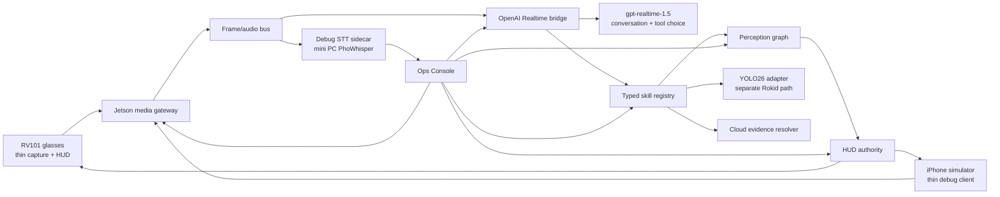

# Architecture Plan

## High-Level Services

Debug STT is deliberately outside the command path.

## Jetson Modules

- `media_gateway`: accepts RV101 TCP H.264, RV101 PCM, simulator WebRTC, websocket/control, and session events.
- `audio_turns`: normalizes audio chunks, energy telemetry, source stability, turn start/commit/cancel, and Realtime audio submission.
- `realtime_agent`: owns OpenAI Realtime sessions, tool schemas, function-call loop, reconnect, model config, and latency metrics.
- `skills`: typed Jetson capability registry. Each skill declares schema, permissions, expected evidence, timeout, local/cloud routing, and HUD result shape.
- `perception`: frame bus, detections, tracks, crops, selected target, short-term evidence buffer, and future memory hooks.
- `hud_authority`: converts skill/perception outputs into compact RV101-safe HUD scene JSON.
- `web_ui`: Ops Console for settings, debug, replay, skill dry-run, trace, HUD mirror, sensor preview, Debug STT, and iPhone simulator links.
- `simulator_bridge`: WebRTC ingest and iPhone-compatible control/result channel.
- `lab_fallbacks`: offline/debug-only tools. They must stay off the primary product route.

## Glasses Modules

- `capture`: Camera2/MediaCodec hardware H.264 and microphone PCM capture.
- `transport`: dedicated video, audio, websocket/control clients with reconnect and metrics.
- `hud_renderer`: lower-safe-zone answer strip, edge chips, thumbnails, target markers, transient alerts.
- `diagnostics`: local capture/transport telemetry, not product UI.
- `protocol`: client-side protocol models generated or mirrored from `shared/`.

The clean v2 Android module is not implemented yet. The buildable app remains `RokidVideoStream` until contracts stabilize.

## Shared Contracts

Contracts are the spine of v2:

- `ClientSession`: device identity, session ID, capabilities, transport state.
- `VideoStream`: codec, width, height, fps, timestamp, frame index, keyframe hints.
- `AudioChunk`: PCM format, timestamp, energy metrics, sequence index.
- `AudioTurn`: start, commit, cancel, latency, VAD/manual state, debug transcript reference.
- `RealtimeEvent`: session state, input audio, output item, function call, error, reconnect.
- `SkillCall`: name, JSON args, evidence refs, result, status, latency, HUD intent.
- `PerceptionObject`: object ID, class, track ID, bbox, score, attributes, crop refs.
- `SelectedTarget`: target ID, reason, confidence, last seen, crop refs, follow-up state.
- `HudScene`: answer strip, edge chips, thumbnails, target reticle, priority, TTL.
- `DebugTranscript`: sidecar source, text, confidence if available, audio turn ID, latency.

## Runtime Flow

1. Client connects and declares capabilities.
2. Jetson creates a session and opens media/control channels.
3. Audio enters `audio_turns`; video enters frame/preview/perception paths.
4. Realtime bridge sends live audio/context/tool schemas to OpenAI.
5. OpenAI decides whether to answer directly or call a typed Jetson skill.
6. Jetson skill executes local perception first, then cloud evidence resolution only if needed.
7. Skill result updates perception graph and selected-target state.
8. HUD authority emits compact `HudScene`.
9. Ops Console records trace and may show Debug STT text for the same completed audio turn.

## Clean v2 Decisions

- OpenAI Realtime conversation + tool calling is primary.
- Debug STT is Ops-only and must not route commands.
- Old prototype modes become typed internal Jetson capabilities or are removed.
- Fake demo outputs are not allowed in product runtime.
- Debug UI may simulate calls only when clearly labelled.
- YOLO26 reuse must stay separate from Ring/security runtime.
