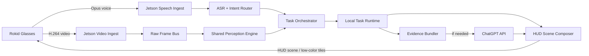

# Rokid - Jetson Voice-First Product Refactor

Updated: 2026-04-19

Tài liệu triển khai chi tiết đi kèm:

- [rokid-voice-first-execution-plan.md](rokid-voice-first-execution-plan.md)

## 1. Mục tiêu mới

Refactor hệ hiện tại từ:

- app kính có nhiều mode
- người dùng chọn mode bằng touchpad
- Jetson chỉ trả `vision_result` theo mode

thành:

- kính là `sensor + mic + thin HUD client`
- Jetson là `brain + orchestrator + renderer authority`
- người dùng nói yêu cầu bằng giọng nói
- Jetson nghe, hiểu, chọn pipeline phù hợp, xử lý local trước
- nếu cần reasoning vượt khả năng local thì Jetson đẩy `evidence bundle` lên ChatGPT API
- kết quả hiển thị lại theo đúng phong cách HUD của Rokid, không phải kiểu app điện thoại Android

Nói ngắn gọn:

`Mode-based smart glasses app` -> `Voice-first visual agent`

## 2. Đánh giá ý tưởng gốc của bạn

Ý tưởng của bạn là đúng hướng sản phẩm hơn rất nhiều so với trạng thái hiện tại.

Điểm mạnh:

- bỏ tư duy “chọn tính năng trên kính” vốn giống app tool hơn là sản phẩm thật
- đưa Jetson lên đúng vai trò trung tâm
- biến các tính năng cũ thành `capability` chứ không phải `screen`
- mở đường cho các tác vụ tự nhiên hơn như:
  - `tìm người mặc áo vàng`
  - `đếm xe bên phải`
  - `có ai quen ở đây không`
  - `đọc giúp biển báo kia`
  - `cảnh này có gì đáng chú ý`

Điểm mình muốn nâng cấp thêm:

- không nên hiểu “Jetson vẽ trực tiếp lên kính” theo nghĩa stream cả framebuffer/UI từ Jetson sang Android app
- cách đó nặng, khó canh alignment, và rất dễ trôi về kiểu remote-desktop mini
- nên làm theo hướng:
  - Jetson quyết định 100% nội dung hiển thị
  - app kính chỉ là `thin compositor`
  - giao tiếp bằng `HUD scene protocol` hoặc `low-color tile protocol`

Tức là:

- về mặt sản phẩm: Jetson là nơi “vẽ”
- về mặt kỹ thuật: kính vẫn render, nhưng chỉ render thứ Jetson mô tả rất gọn

## 3. Chuyển đổi tư duy sản phẩm

### Trước đây

Sản phẩm đang có xu hướng:

- mở app
- vuốt chọn mode
- chạy một task cố định
- HUD phản ánh mode đó

Vấn đề:

- giống công cụ kỹ thuật hơn là trợ lý thật
- người dùng phải nhớ mode
- UI dễ bị thiết kế như dashboard Android thu nhỏ
- khó mở rộng sang truy vấn tự nhiên

### Sau refactor

Sản phẩm nên hoạt động như:

- người dùng đeo kính
- kính luôn stream video + voice nhẹ về Jetson
- Jetson luôn duy trì nhận thức cơ bản ở mức tiết kiệm
- khi người dùng nói, Jetson hiểu ý định và kích hoạt đúng năng lực
- khi không có việc, HUD gần như im lặng
- khi có kết quả, HUD hiện ngắn gọn, đúng ngữ cảnh

Sản phẩm khi đó không còn là:

- `ứng dụng chọn mode`

Mà là:

- `trợ lý thị giác đeo được`

## 4. Nguyên tắc thiết kế cấp sản phẩm

### 4.1 Kính không phải điện thoại

Đây là nguyên tắc số 1.

- không làm UI theo kiểu app Android phone
- không cố đẩy nhiều screen/flow/local navigation lên kính
- không để user phải “vào tính năng A/B/C” như mở app trên phone

### 4.2 Kính là terminal mỏng

Phía kính chỉ nên giữ:

- camera
- microphone
- transport
- audio capture state
- thin renderer theo chuẩn Rokid
- local fallback minimal

### 4.3 Jetson là bộ não

Jetson nên sở hữu:

- speech understanding
- task planning
- detector/tracker/attribute logic
- query execution
- memory ngắn hạn
- escalation lên cloud
- final render state

### 4.4 Local-first, cloud-smart

Không được để mọi câu hỏi đều đẩy lên cloud.

Chiến lược đúng:

- local first
- local narrow first
- local compress first
- cloud only when needed

## 5. Kiến trúc đích

## 6. Phân lớp hệ thống mới

## 6.1 Glass Client

Vai trò:

- stream video
- stream mic
- nhận HUD scene
- render theo `Rokid safe zone + alignment`

Không nên làm:

- không local AI
- không local intent logic
- không local feature switching
- không local image analysis nặng

### Thành phần nên có

- `Video Ingest Client`
- `Audio Ingest Client`
- `Thin HUD Renderer`
- `Connection / session state`
- `Mic state chip`
- `Fallback local status only`

## 6.2 Jetson Core

Vai trò:

- nhận media
- duy trì perception graph
- hiểu voice intent
- chọn task runtime
- quyết định render

### Thành phần nên có

- `Media Session Manager`
- `Frame Bus`
- `Shared Perception Engine`
- `Speech Stack`
- `Intent Router`
- `Task Orchestrator`
- `Task Runtime Registry`
- `Evidence Bundler`
- `Cloud Escalation Adapter`
- `HUD Scene Composer`

## 6.3 Cloud Reasoning Layer

Vai trò:

- xử lý các yêu cầu đòi hỏi reasoning nhiều bước
- xử lý mô tả ngôn ngữ tự nhiên khó
- kết hợp transcript + crop + OCR + scene summary

Không nên dùng cloud để:

- detect mọi frame
- tracking liên tục
- đếm realtime khung hình nào cũng gửi

## 7. Luồng media mới

## 7.1 Video

Khuyến nghị:

- tạm thời giữ `H.264 TCP ingest` hiện tại vì đã prove ổn
- chỉ tối ưu thêm nếu đo được bottleneck thật

Lý do:

- video path hiện tại đã ổn hơn trước khá nhiều
- chưa cần phá đường stream đang chạy được
- phần cần refactor lớn nhất bây giờ là orchestration, voice, và render protocol

Tối ưu thêm nếu cần:

- giữ current video path cho MVP refactor
- sau đó cân nhắc QUIC/WebRTC chỉ khi:
  - mạng Internet kém
  - reconnect đau
  - packet loss gây vấn đề thực sự

## 7.2 Voice

Đây là phần mới quan trọng.

Do audio không cần sync với video, kiến trúc nên đơn giản và rẻ:

- mono
- `16kHz` hoặc `24kHz`
- `Opus`
- kênh riêng

Khuyến nghị:

- `Opus mono` bitrate thấp
- transport riêng với video
- có `VAD` ở kính hoặc Jetson

### Hai mức triển khai

#### Mức 1: push-to-talk

- ổn định hơn
- ít tốn pin hơn
- dễ MVP hơn

#### Mức 2: always-listening

- cần wake word hoặc VAD tốt
- cần quản lý pin và riêng tư kỹ hơn
- nên làm sau khi MVP voice-first đã ngon

Mình khuyên:

- phase đầu dùng `push-to-talk`
- phase sau mới mở `always-listening`

## 8. Speech stack trên Jetson

Luồng nên là:

`audio -> VAD -> ASR -> intent parse -> task plan`

### Các lớp nên có

- `Voice Activity Detection`
- `Streaming ASR`
- `Intent Classifier`
- `Task Parser`
- `Dialog State`

### Loại intent

- `watch`
  - `theo dõi người áo vàng`
- `query`
  - `có ai quanh tôi không`
- `find`
  - `tìm ba lô màu đen`
- `count`
  - `đếm xe bên phải`
- `identify`
  - `có người quen nào không`
- `read`
  - `đọc chữ trên biển báo`
- `summarize`
  - `mô tả cảnh này`
- `compare`
  - `trong mấy người kia ai mặc áo vàng`

## 9. Shared Perception Engine

Đây là lõi để tận dụng Jetson thật sự tốt.

Không nên làm:

- mỗi tính năng một detector/process riêng

Nên làm:

- một perception graph chia sẻ
- nhiều task runtime tái sử dụng graph đó

### Lớp perception nên có

#### A. Shared detector

- YOLO26 làm detector chung
- chịu trách nhiệm:
  - person
  - vehicle
  - bag
  - object classes phổ biến

#### B. Tracker layer

- track ID xuyên frame
- giữ memory ngắn hạn
- phục vụ count, follow, gallery

#### C. Attribute layer

Đây là lớp rất quan trọng cho use case mới.

Ví dụ:

- color attribute
- shirt / upper-body dominant color
- size / distance estimate thô
- left / ahead / right zone
- text presence
- gesture / hand raise simple flag

#### D. Face layer

- face detect
- embedding
- local match

#### E. OCR / sign layer

- đọc text khi cần
- không chạy liên tục nếu không cần

## 10. Task runtime mới

Thay vì “mode”, hệ mới nên có `task runtime`.

Mỗi runtime là một “năng lực chạy theo yêu cầu”:

- `face memory runtime`
- `traffic runtime`
- `find-by-attribute runtime`
- `scene summary runtime`
- `ocr runtime`
- `follow-target runtime`
- `alert runtime`

Task runtime:

- dùng chung perception engine
- chỉ thêm logic cụ thể
- có thể bật/tắt động

## 11. Ví dụ: tìm người mặc áo vàng

Đây là use case rất phù hợp với kiến trúc mới.

Luồng đúng nên là:

1. User nói:
   - `tìm người mặc áo vàng`
2. Jetson ASR ra transcript
3. Intent router hiểu:
   - task type = `find_person_by_attribute`
   - attribute = `yellow shirt`
4. Jetson bật runtime:
   - person detection
   - tracker
   - upper-body color scoring
5. Jetson tạo candidate list:
   - track 12
   - track 18
   - track 24
6. Jetson crop thumbnail từng candidate
7. HUD trên kính hiện:
   - góc trên/phải hoặc góc dưới/phải
   - 2-4 thumb nhỏ
   - label:
     - `yellow 1`
     - `yellow 2`
     - `yellow 3`
8. Nếu user hỏi tiếp:
   - `người nào gần nhất`
   - `chỉ cho tôi người bên trái`
   Jetson dùng lại candidate set cũ

### Điều cần lưu ý

- không gửi full frame lên cloud chỉ để tìm áo vàng
- local filtering và local crop trước
- chỉ khi mơ hồ mới đẩy `candidate bundle` lên ChatGPT API để reasoning thêm

## 12. Khi nào đẩy lên ChatGPT API

Cloud nên là lớp reasoning và language grounding, không phải detector realtime.

### Local đủ xử lý

Các việc nên local hoàn toàn:

- đếm người
- đếm xe
- face memory
- tìm object class cơ bản
- lọc theo vùng trái/phải/trước
- lọc theo màu đơn giản
- cảnh báo realtime

### Cloud nên xử lý

Các việc phù hợp để đẩy tiếp:

- mô tả cảnh phức tạp bằng ngôn ngữ tự nhiên
- giải thích một tình huống
- câu hỏi kết hợp nhiều điều kiện
- suy luận trên candidate set
- tóm tắt OCR + object + face + context

### Evidence bundle nên gửi thay vì full stream

Khi cần cloud, Jetson chỉ nên gửi:

- transcript
- 1-4 crop liên quan
- scene summary gọn
- OCR text nếu có
- metadata:
  - zone
  - confidence
  - track IDs
  - timestamps

Điều này:

- tiết kiệm bandwidth
- giảm cost API
- giảm rủi ro riêng tư
- nhanh hơn nhiều

## 13. Hệ render mới cho kính

Đây là chỗ quan trọng nhất về mặt UX.

## 13.1 Không nên làm

Không nên:

- stream nguyên UI bitmap full-frame từ Jetson về kính
- render kiểu app Android/phone mini
- để mỗi task là một màn hình riêng
- đẩy nhiều màu/gradient nặng vô ích

## 13.2 Nên làm

Nên tạo `Rokid HUD Scene Protocol`.

Jetson gửi về:

- `chips`
- `cards`
- `gallery tiles`
- `focus bubble`
- `markers`
- `guide lines`
- `subtitle / answer strip`
- `alert burst`

App kính chỉ render protocol này theo safe zone và alignment chuẩn Rokid.

### Đây là mô hình tốt nhất

- Jetson quyết định nội dung
- kính chỉ là renderer mỏng
- vẫn đúng bản chất see-through HUD
- không biến thành full remote app

## 13.3 Ba lựa chọn render plane

### Option A: Declarative HUD Scene Graph

Jetson gửi JSON scene kiểu:

- component type
- text
- position zone
- priority
- style token
- optional thumbnail refs

Ưu điểm:

- nhẹ nhất
- hợp Rokid nhất
- dễ versioning
- dễ tối ưu

Nhược điểm:

- cần thiết kế protocol tốt

### Option B: Low-color Tile Stream

Jetson gửi:

- ảnh tile nhỏ
- 1-bit, 2-bit hoặc 4-bit grayscale / limited green palette
- chỉ cho crop/gallery/mini-preview

Ưu điểm:

- phù hợp nếu muốn thumb thật
- vẫn khá nhẹ

Nhược điểm:

- phức tạp hơn declarative

### Option C: Full overlay pixel stream

Không khuyến nghị cho sản phẩm chính.

Ưu điểm:

- dễ nghĩ

Nhược điểm:

- nặng
- dễ trễ
- khó giữ phong cách Rokid
- dễ trôi thành Android UI remote

### Khuyến nghị

Làm hybrid:

- text / chips / markers / line -> declarative
- crop gallery / mini thumbs -> low-color tiles

Đây là phương án cân bằng nhất.

## 14. Style system cho HUD mới

HUD mới phải bám tư duy Rokid, không phải phone UI.

Nên dùng:

- monochrome-first
- high-contrast
- small card / chip / strip
- lower-safe-zone hoặc edge-safe-zone
- trạng thái quiet-by-default

Không nên dùng:

- card to ở giữa
- list dày
- nhiều lớp mờ chồng nhau
- full color khi không cần

### Các component nền nên có

- `MicChip`
- `TaskChip`
- `AnswerStrip`
- `AlertBurst`
- `FocusBubble`
- `CandidateGallery`
- `TrafficGuideLine`
- `DirectionalMarker`
- `MiniFaceCard`

## 15. Resource policy

## 15.1 Trên kính

Phải cực tiết kiệm.

Kính chỉ nên tốn cho:

- camera
- mic
- encode
- transport
- thin HUD render

Không tốn cho:

- object detection
- feature logic
- complex animation
- local scene reasoning

## 15.2 Trên Jetson

Jetson cần có scheduler theo task.

Chế độ hợp lý:

- `idle perception`
  - detector cadence thấp
  - speech luôn sẵn sàng
- `active task`
  - bật runtime cần thiết
- `escalated reasoning`
  - gom evidence rồi gửi cloud
- `quiet fallback`
  - unload các thứ không cần

## 16. Lộ trình refactor thực tế

Không nên rewrite tất cả một lúc.

## Phase 1: Voice input foundation

- thêm audio stream từ kính
- Jetson nhận voice
- push-to-talk trước
- ASR + intent parse cơ bản
- giữ video path hiện tại

Kết quả:

- user nói được yêu cầu
- Jetson hiểu và map sang capability

## Phase 2: Task orchestrator

- bỏ logic chọn mode từ kính
- thêm `task runtime registry`
- map tính năng cũ thành runtime
- Jetson chủ động bật/tắt runtime

Kết quả:

- `face memory`, `traffic`, `visual search` không còn là screen riêng

## Phase 3: HUD scene protocol

- Jetson gửi `scene graph`
- app kính chuyển thành thin renderer
- UI bám phong cách Rokid
- bỏ dần feature-specific UI cứng trong app

Kết quả:

- kính không còn là app nhiều screen
- kính trở thành HUD terminal

## Phase 4: Attribute search

- thêm color / apparel / direction / proximity filters
- hỗ trợ:
  - `người áo vàng`
  - `ba lô đen`
  - `xe tải bên phải`

Kết quả:

- bắt đầu có giá trị “visual search” thực sự

## Phase 5: Cloud smart escalation

- local evidence bundler
- ChatGPT API cho reasoning khó
- response tóm gọn lại theo HUD format

Kết quả:

- hệ trở thành trợ lý thị giác thật sự, không chỉ detector

## 17. Những gì cần tránh khi refactor

- đừng rewrite video stream ngay nếu chưa bị bottleneck
- đừng stream full UI frame từ Jetson về kính
- đừng đẩy mọi voice query lên cloud
- đừng giữ tư duy `mode picker`
- đừng để app kính thành nơi chứa logic sản phẩm
- đừng thiết kế HUD kiểu điện thoại Android

## 18. Cách chốt kiến trúc sản phẩm

Nếu phải chốt một câu duy nhất:

`Rokid là mắt + tai + HUD, Jetson là não, cloud là lớp suy luận mở rộng khi local không đủ.`

Đó là hướng đúng nhất để biến hệ này thành sản phẩm thực sự.

## 19. Kiến nghị chốt cho vòng tiếp theo

Nếu bắt đầu thực hiện thật, thứ tự tốt nhất là:

1. thêm audio ingest + push-to-talk
2. thêm ASR + intent router
3. thêm task orchestrator thay cho mode selection
4. thiết kế `HUD Scene Protocol`
5. map traffic / face / visual search vào runtime
6. chỉ sau đó mới nối ChatGPT API

Với thứ tự này:

- không phá đường stream đang ổn
- không làm kính nặng lên
- không đi sai sang hướng app điện thoại
- giữ được nền tảng tốt để mở rộng thành sản phẩm thật
